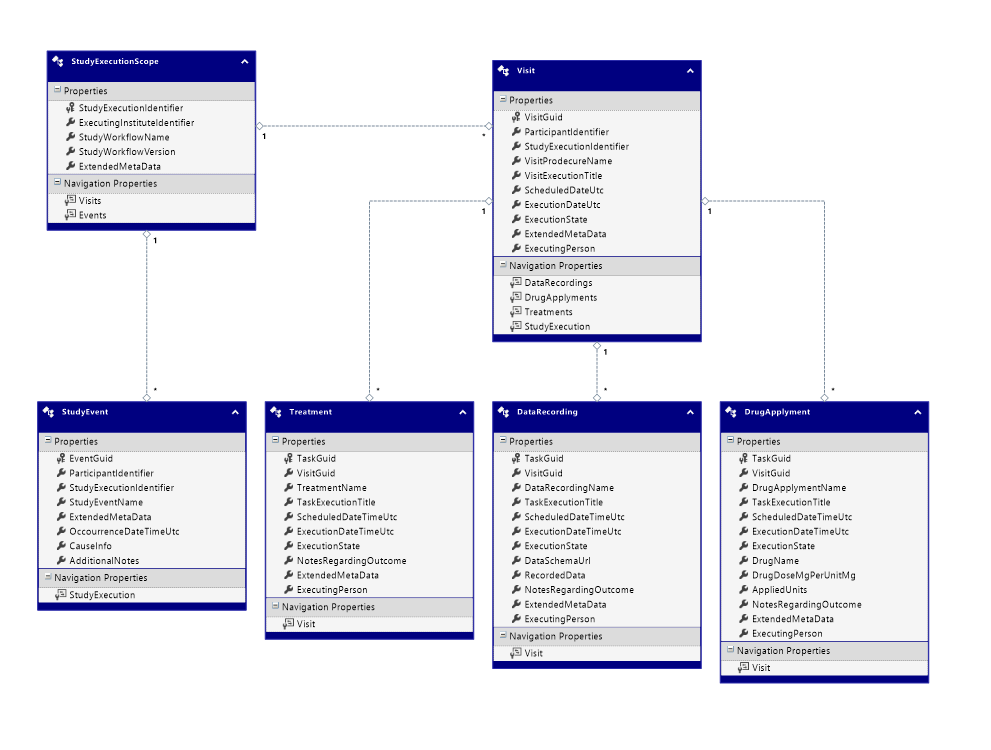

# ORSCF-VisitData Schema Specification
author: ORSCF ("Open Research Study Communication Formats")
license: [Apache-2](https://choosealicense.com/licenses/apache-2.0/)
last update: 13.03.2021
add. info: [orscf.org](https://www.orscf.org)
 
 
# Model:




## DataRecording


### Fields

| Name | Type | Required | Fix |
| ---- | ---- | -------- | --- |
| [TaskGuid](#DataRecordingTaskGuid-Field) **(KEY)** | *guid* | YES | YES |
| [VisitGuid](#DataRecordingVisitGuid-Field) (FK) | *guid* | YES | no |
| [DataRecordingName](#DataRecordingDataRecordingName-Field) | *string* | YES | no |
| [TaskExecutionTitle](#DataRecordingTaskExecutionTitle-Field) | *string* | YES | no |
| [ScheduledDateTimeUtc](#DataRecordingScheduledDateTimeUtc-Field) | *datetime* | no | no |
| [ExecutionDateTimeUtc](#DataRecordingExecutionDateTimeUtc-Field) | *datetime* | no | no |
| [ExecutionState](#DataRecordingExecutionState-Field) | *int32* | YES | no |
| [DataSchemaUrl](#DataRecordingDataSchemaUrl-Field) | *string* | YES | no |
| [RecordedData](#DataRecordingRecordedData-Field) | *string* | YES | no |
| [NotesRegardingOutcome](#DataRecordingNotesRegardingOutcome-Field) | *string* | no | no |
| [ExtendedMetaData](#DataRecordingExtendedMetaData-Field) | *string* | YES | no |
| [ExecutingPerson](#DataRecordingExecutingPerson-Field) | *string* | no | no |
##### DataRecording.**TaskGuid** (Field)
```
a global unique id of a concrete study-task execution which is usually originated at the primary CRF or study management system ('SMS')
```
* this field represents the identity (PK) of the record
* after the record has been created, the value of this field must not be changed any more!
##### DataRecording.**VisitGuid** (Field)
```
the guid of the visit in which this task was executed
```
* this field is used as foreign key to address the related 'Visit'
##### DataRecording.**DataRecordingName** (Field)
```
unique invariant name of ths task-procedure as defined in the 'StudyWorkflowDefinition' (originated from the sponsor)
```
##### DataRecording.**TaskExecutionTitle** (Field)
```
title of the task execution as defined in the 'StudyWorkflowDefinition' (originated from the sponsor)
```
##### DataRecording.**ScheduledDateTimeUtc** (Field)
```
the estimated date when the visit is scheduled
```
* this field is optional, so that '*null*' values are supported
##### DataRecording.**ExecutionDateTimeUtc** (Field)
```
the real time, when the data was recorded
```
* this field is optional, so that '*null*' values are supported
##### DataRecording.**ExecutionState** (Field)
```
0=Unscheduled / 1=Sheduled / 2=Executed / 3=AbortDuringExecution / 4=Skipped / 5=Removed
```
##### DataRecording.**DataSchemaUrl** (Field)
```
schema-url of the data which were stored inside of the 'RecordedData' field
```
##### DataRecording.**RecordedData** (Field)
```
RAW data, in the schema as defined at the 'DataSchemaUrl'
```
##### DataRecording.**NotesRegardingOutcome** (Field)
```
additional notes regarding this dedcated execution (supplied by the execution person)
```
* this field is optional, so that '*null*' values are supported
##### DataRecording.**ExtendedMetaData** (Field)
```
optional structure (in JSON-format) containing additional metadata regarding this record, which can be used by 'StudyExecutionSystems' to extend the schema
```
##### DataRecording.**ExecutingPerson** (Field)
```
self describing ...
```
* this field is optional, so that '*null*' values are supported


### Relations

| Name | Role | Target-Type | Target-Multiplicity |
| ---- | ---- | ----------- | ------------------- |
| [Visit](#Visit-parent-of-this-DataRecording) | Parent | [Visit](#Visit) | 0/1 (optional) |

##### **Visit** (parent of this DataRecording)
Target Type: [Visit](#Visit)
Addressed by: [VisitGuid](#DataRecordingVisitGuid-Field).
```
self describing ...
```


## Visit


### Fields

| Name | Type | Required | Fix |
| ---- | ---- | -------- | --- |
| [VisitGuid](#VisitVisitGuid-Field) **(KEY)** | *guid* | YES | YES |
| [ParticipantIdentifier](#VisitParticipantIdentifier-Field) | *string* (50) | YES | YES |
| [StudyExecutionIdentifier](#VisitStudyExecutionIdentifier-Field) (FK) | *guid* | YES | no |
| [VisitProdecureName](#VisitVisitProdecureName-Field) | *string* | YES | no |
| [VisitExecutionTitle](#VisitVisitExecutionTitle-Field) | *string* | YES | no |
| [ScheduledDateUtc](#VisitScheduledDateUtc-Field) | *datetime* | no | no |
| [ExecutionDateUtc](#VisitExecutionDateUtc-Field) | *datetime* | no | no |
| [ExecutionState](#VisitExecutionState-Field) | *int32* | YES | no |
| [ExtendedMetaData](#VisitExtendedMetaData-Field) | *string* | no | no |
| [ExecutingPerson](#VisitExecutingPerson-Field) | *string* | no | no |
##### Visit.**VisitGuid** (Field)
```
a global unique id of a concrete study-visit execution which is usually originated at the primary CRF or study management system ('SMS')
```
* this field represents the identity (PK) of the record
* after the record has been created, the value of this field must not be changed any more!
##### Visit.**ParticipantIdentifier** (Field)
```
identity of the patient which can be a randomization or screening number (the exact semantic is defined per study)
```
* the maximum length of the content within this field is 50 characters.
* after the record has been created, the value of this field must not be changed any more!
##### Visit.**StudyExecutionIdentifier** (Field)
```
a global unique id of a concrete study execution (dedicated to a concrete institute) which is usually originated at the primary CRF or study management system ('SMS')
```
* this field is used as foreign key to address the related 'StudyExecution'
##### Visit.**VisitProdecureName** (Field)
```
unique invariant name of the visit-procedure as defined in the 'StudyWorkflowDefinition' (originated from the sponsor)
```
##### Visit.**VisitExecutionTitle** (Field)
```
title of the visit execution as defined in the 'StudyWorkflowDefinition' (originated from the sponsor)
```
##### Visit.**ScheduledDateUtc** (Field)
```
the estimated date when the visit is scheduled for execution
```
* this field is optional, so that '*null*' values are supported
##### Visit.**ExecutionDateUtc** (Field)
```
the real date, when the visits was executed
```
* this field is optional, so that '*null*' values are supported
##### Visit.**ExecutionState** (Field)
```
0=Unscheduled / 1=Sheduled / 2=Executed / 3=AbortDuringExecution / 4=Skipped / 5=Removed
```
##### Visit.**ExtendedMetaData** (Field)
```
optional structure (in JSON-format) containing additional metadata regarding this record, which can be used by 'StudyExecutionSystems' to extend the schema
```
* this field is optional, so that '*null*' values are supported
##### Visit.**ExecutingPerson** (Field)
```
self describing ...
```
* this field is optional, so that '*null*' values are supported


### Relations

| Name | Role | Target-Type | Target-Multiplicity |
| ---- | ---- | ----------- | ------------------- |
| [DataRecordings](#DataRecordings-childs-of-this-Visit) | Childs | [DataRecording](#DataRecording) | * (multiple) |
| [DrugApplyments](#DrugApplyments-childs-of-this-Visit) | Childs | [DrugApplyment](#DrugApplyment) | * (multiple) |
| [StudyExecution](#StudyExecution-lookup-from-this-Visit) | Lookup | [StudyExecutionScope](#StudyExecutionScope) | 0/1 (optional) |
| [Treatments](#Treatments-childs-of-this-Visit) | Childs | [Treatment](#Treatment) | * (multiple) |

##### **DataRecordings** (childs of this Visit)
Target: [DataRecording](#DataRecording)
```
all the data which has been captured for this visit
```
##### **DrugApplyments** (childs of this Visit)
Target: [DrugApplyment](#DrugApplyment)
```
all the drug applyments which have been executed for this visit
```
##### **StudyExecution** (lookup from this Visit)
Target Type: [StudyExecutionScope](#StudyExecutionScope)
Addressed by: [StudyExecutionIdentifier](#VisitStudyExecutionIdentifier-Field).
```
self describing ...
```
##### **Treatments** (childs of this Visit)
Target: [Treatment](#Treatment)
```
all the treatments which have been executed for this visit
```


## DrugApplyment


### Fields

| Name | Type | Required | Fix |
| ---- | ---- | -------- | --- |
| [TaskGuid](#DrugApplymentTaskGuid-Field) **(KEY)** | *guid* | YES | YES |
| [VisitGuid](#DrugApplymentVisitGuid-Field) (FK) | *guid* | YES | no |
| [DrugApplymentName](#DrugApplymentDrugApplymentName-Field) | *string* | YES | no |
| [TaskExecutionTitle](#DrugApplymentTaskExecutionTitle-Field) | *string* | YES | no |
| [ScheduledDateTimeUtc](#DrugApplymentScheduledDateTimeUtc-Field) | *datetime* | no | no |
| [ExecutionDateTimeUtc](#DrugApplymentExecutionDateTimeUtc-Field) | *datetime* | no | no |
| [ExecutionState](#DrugApplymentExecutionState-Field) | *int32* | YES | no |
| [DrugName](#DrugApplymentDrugName-Field) | *string* | YES | no |
| [DrugDoseMgPerUnitMg](#DrugApplymentDrugDoseMgPerUnitMg-Field) | *decimal* | YES | no |
| [AppliedUnits](#DrugApplymentAppliedUnits-Field) | *decimal* | YES | no |
| [NotesRegardingOutcome](#DrugApplymentNotesRegardingOutcome-Field) | *string* | no | no |
| [ExtendedMetaData](#DrugApplymentExtendedMetaData-Field) | *string* | YES | no |
| [ExecutingPerson](#DrugApplymentExecutingPerson-Field) | *string* | no | no |
##### DrugApplyment.**TaskGuid** (Field)
```
a global unique id of a concrete study-task execution which is usually originated at the primary CRF or study management system ('SMS')
```
* this field represents the identity (PK) of the record
* after the record has been created, the value of this field must not be changed any more!
##### DrugApplyment.**VisitGuid** (Field)
```
the guid of the visit in which this task was executed
```
* this field is used as foreign key to address the related 'Visit'
##### DrugApplyment.**DrugApplymentName** (Field)
```
unique invariant name of the study itself as defined in the 'StudyWorkflowDefinition' (originated from the sponsor)
```
##### DrugApplyment.**TaskExecutionTitle** (Field)
```
title of the task execution as defined in the 'StudyWorkflowDefinition' (originated from the sponsor)
```
##### DrugApplyment.**ScheduledDateTimeUtc** (Field)
```
the estimated time when the drug applyment is scheduled
```
* this field is optional, so that '*null*' values are supported
##### DrugApplyment.**ExecutionDateTimeUtc** (Field)
```
the real date, when the visits was executed
```
* this field is optional, so that '*null*' values are supported
##### DrugApplyment.**ExecutionState** (Field)
```
0=Unscheduled / 1=Sheduled / 2=Executed / 3=AbortDuringExecution / 4=Skipped / 5=Removed
```
##### DrugApplyment.**DrugName** (Field)
```
name of the drug
```
##### DrugApplyment.**DrugDoseMgPerUnitMg** (Field)
```
dose (mg) which is inside of one unit
```
##### DrugApplyment.**AppliedUnits** (Field)
```
amount of applied units
```
##### DrugApplyment.**NotesRegardingOutcome** (Field)
```
additional notes regarding this dedcated execution (supplied by the execution person)
```
* this field is optional, so that '*null*' values are supported
##### DrugApplyment.**ExtendedMetaData** (Field)
```
optional structure (in JSON-format) containing additional metadata regarding this record, which can be used by 'StudyExecutionSystems' to extend the schema
```
##### DrugApplyment.**ExecutingPerson** (Field)
```
self describing ...
```
* this field is optional, so that '*null*' values are supported


### Relations

| Name | Role | Target-Type | Target-Multiplicity |
| ---- | ---- | ----------- | ------------------- |
| [Visit](#Visit-parent-of-this-DrugApplyment) | Parent | [Visit](#Visit) | 0/1 (optional) |

##### **Visit** (parent of this DrugApplyment)
Target Type: [Visit](#Visit)
Addressed by: [VisitGuid](#DrugApplymentVisitGuid-Field).
```
self describing ...
```


## StudyEvent


### Fields

| Name | Type | Required | Fix |
| ---- | ---- | -------- | --- |
| [EventGuid](#StudyEventEventGuid-Field) **(KEY)** | *guid* | YES | no |
| [ParticipantIdentifier](#StudyEventParticipantIdentifier-Field) | *string* | YES | no |
| [StudyExecutionIdentifier](#StudyEventStudyExecutionIdentifier-Field) (FK) | *guid* | YES | no |
| [StudyEventName](#StudyEventStudyEventName-Field) | *string* | YES | no |
| [ExtendedMetaData](#StudyEventExtendedMetaData-Field) | *string* | no | no |
| [OccourrenceDateTimeUtc](#StudyEventOccourrenceDateTimeUtc-Field) | *datetime* | YES | no |
| [CauseInfo](#StudyEventCauseInfo-Field) | *string* | YES | no |
| [AdditionalNotes](#StudyEventAdditionalNotes-Field) | *string* | no | no |
##### StudyEvent.**EventGuid** (Field)
```
a global unique id of a concrete study-event occurrence which is usually originated at the primary CRF or study management system ('SMS')
```
* this field represents the identity (PK) of the record
##### StudyEvent.**ParticipantIdentifier** (Field)
```
identity of the patient which can be a randomization or screening number (the exact semantic is defined per study)
```
##### StudyEvent.**StudyExecutionIdentifier** (Field)
```
a global unique id of a concrete study execution (dedicated to a concrete institute) which is usually originated at the primary CRF or study management system ('SMS')
```
* this field is used as foreign key to address the related 'StudyExecution'
##### StudyEvent.**StudyEventName** (Field)
```
unique invariant name of the event as defined in the 'StudyWorkflowDefinition' (originated from the sponsor)
```
##### StudyEvent.**ExtendedMetaData** (Field)
```
optional structure (in JSON-format) containing additional metadata regarding this record, which can be used by 'StudyExecutionSystems' to extend the schema
```
* this field is optional, so that '*null*' values are supported
##### StudyEvent.**OccourrenceDateTimeUtc** (Field)
```
self describing ...
```
##### StudyEvent.**CauseInfo** (Field)
```
self describing ...
```
##### StudyEvent.**AdditionalNotes** (Field)
```
additional notes (supplied by the execution person)
```
* this field is optional, so that '*null*' values are supported


### Relations

| Name | Role | Target-Type | Target-Multiplicity |
| ---- | ---- | ----------- | ------------------- |
| [StudyExecution](#StudyExecution-lookup-from-this-StudyEvent) | Lookup | [StudyExecutionScope](#StudyExecutionScope) | 0/1 (optional) |

##### **StudyExecution** (lookup from this StudyEvent)
Target Type: [StudyExecutionScope](#StudyExecutionScope)
Addressed by: [StudyExecutionIdentifier](#StudyEventStudyExecutionIdentifier-Field).
```
self describing ...
```


## StudyExecutionScope


### Fields

| Name | Type | Required | Fix |
| ---- | ---- | -------- | --- |
| [StudyExecutionIdentifier](#StudyExecutionScopeStudyExecutionIdentifier-Field) **(KEY)** | *guid* | YES | YES |
| [ExecutingInstituteIdentifier](#StudyExecutionScopeExecutingInstituteIdentifier-Field) | *string* | YES | YES |
| [StudyWorkflowName](#StudyExecutionScopeStudyWorkflowName-Field) | *string* (100) | YES | YES |
| [StudyWorkflowVersion](#StudyExecutionScopeStudyWorkflowVersion-Field) | *string* (20) | YES | YES |
| [ExtendedMetaData](#StudyExecutionScopeExtendedMetaData-Field) | *string* | no | no |
##### StudyExecutionScope.**StudyExecutionIdentifier** (Field)
```
a global unique id of a concrete study execution (dedicated to a concrete institute) which is usually originated at the primary CRF or study management system ('SMS')
```
* this field represents the identity (PK) of the record
* after the record has been created, the value of this field must not be changed any more!
##### StudyExecutionScope.**ExecutingInstituteIdentifier** (Field)
```
the institute which is executing the study (this should be an invariant technical representation of the company name or a guid)
```
* after the record has been created, the value of this field must not be changed any more!
##### StudyExecutionScope.**StudyWorkflowName** (Field)
```
the official invariant name of the study as given by the sponsor
```
* the maximum length of the content within this field is 100 characters.
* after the record has been created, the value of this field must not be changed any more!
##### StudyExecutionScope.**StudyWorkflowVersion** (Field)
```
version of the workflow
```
* the maximum length of the content within this field is 20 characters.
* after the record has been created, the value of this field must not be changed any more!
##### StudyExecutionScope.**ExtendedMetaData** (Field)
```
optional structure (in JSON-format) containing additional metadata regarding this record, which can be used by 'StudyExecutionSystems' to extend the schema
```
* this field is optional, so that '*null*' values are supported


### Relations

| Name | Role | Target-Type | Target-Multiplicity |
| ---- | ---- | ----------- | ------------------- |
| [Events](#Events-refering-to-this-StudyExecutionScope) | Referers | [StudyEvent](#StudyEvent) | * (multiple) |
| [Visits](#Visits-refering-to-this-StudyExecutionScope) | Referers | [Visit](#Visit) | * (multiple) |

##### **Events** (refering to this StudyExecutionScope)
Target: [StudyEvent](#StudyEvent)
```
self describing ...
```
##### **Visits** (refering to this StudyExecutionScope)
Target: [Visit](#Visit)
```
self describing ...
```


## Treatment


### Fields

| Name | Type | Required | Fix |
| ---- | ---- | -------- | --- |
| [TaskGuid](#TreatmentTaskGuid-Field) **(KEY)** | *guid* | YES | YES |
| [VisitGuid](#TreatmentVisitGuid-Field) (FK) | *guid* | YES | no |
| [TreatmentName](#TreatmentTreatmentName-Field) | *string* | YES | no |
| [TaskExecutionTitle](#TreatmentTaskExecutionTitle-Field) | *string* | YES | no |
| [ScheduledDateTimeUtc](#TreatmentScheduledDateTimeUtc-Field) | *datetime* | no | no |
| [ExecutionDateTimeUtc](#TreatmentExecutionDateTimeUtc-Field) | *datetime* | no | no |
| [ExecutionState](#TreatmentExecutionState-Field) | *int32* | YES | no |
| [NotesRegardingOutcome](#TreatmentNotesRegardingOutcome-Field) | *string* | no | no |
| [ExtendedMetaData](#TreatmentExtendedMetaData-Field) | *string* | YES | no |
| [ExecutingPerson](#TreatmentExecutingPerson-Field) | *string* | no | no |
##### Treatment.**TaskGuid** (Field)
```
a global unique id of a concrete study-task execution which is usually originated at the primary CRF or study management system ('SMS')
```
* this field represents the identity (PK) of the record
* after the record has been created, the value of this field must not be changed any more!
##### Treatment.**VisitGuid** (Field)
```
the guid of the visit in which this task was executed
```
* this field is used as foreign key to address the related 'Visit'
##### Treatment.**TreatmentName** (Field)
```
unique invariant name of ths task-procedure as defined in the 'StudyWorkflowDefinition' (originated from the sponsor)
```
##### Treatment.**TaskExecutionTitle** (Field)
```
title of the task execution as defined in the 'StudyWorkflowDefinition' (originated from the sponsor)
```
##### Treatment.**ScheduledDateTimeUtc** (Field)
```
the estimated time when the treatment is scheduled
```
* this field is optional, so that '*null*' values are supported
##### Treatment.**ExecutionDateTimeUtc** (Field)
```
the real time, when the treatment was executed
```
* this field is optional, so that '*null*' values are supported
##### Treatment.**ExecutionState** (Field)
```
0=Unscheduled / 1=Sheduled / 2=Executed / 3=AbortDuringExecution / 4=Skipped / 5=Removed
```
##### Treatment.**NotesRegardingOutcome** (Field)
```
additional notes regarding this dedcated execution (supplied by the execution person)
```
* this field is optional, so that '*null*' values are supported
##### Treatment.**ExtendedMetaData** (Field)
```
optional structure of additional metadata regarding this record in JSON-format, which can be used by study execution systems to extend the schema
```
##### Treatment.**ExecutingPerson** (Field)
```
self describing ...
```
* this field is optional, so that '*null*' values are supported


### Relations

| Name | Role | Target-Type | Target-Multiplicity |
| ---- | ---- | ----------- | ------------------- |
| [Visit](#Visit-parent-of-this-Treatment) | Parent | [Visit](#Visit) | 0/1 (optional) |

##### **Visit** (parent of this Treatment)
Target Type: [Visit](#Visit)
Addressed by: [VisitGuid](#TreatmentVisitGuid-Field).
```
self describing ...
```


